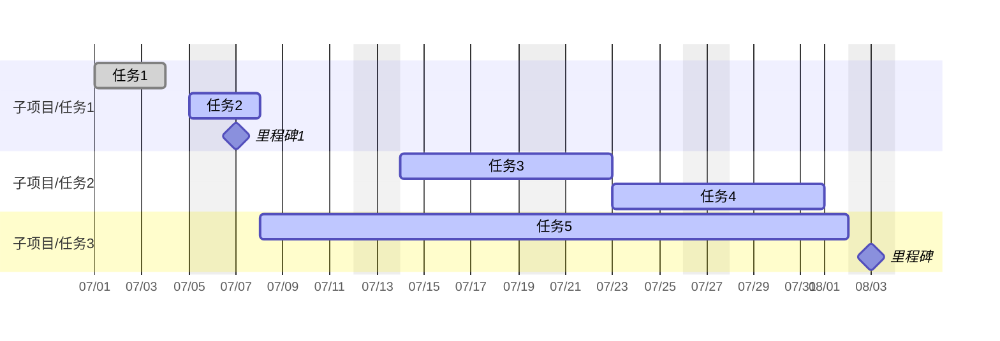

# 🚧 项目: 测试项目1

## 🎯 项目目标
>*项目的最终成果描述或项目期望达成的具体成果*


## 项目分解
>*将复杂项目分解成可执行的小项目。*

### 子项目/任务1
- [x] 任务1 🛫 2025-07-01 📅 2025-07-03 
- [ ] 任务2 🛫 2025-07-05 📅 2025-07-08 
- [ ] 里程碑1 📅 2025-07-07 [keyword::@milestone]

### 子项目/任务2
- [ ] 任务3 🛫 2025-07-14 📅 2025-07-22 🆔 task3
- [ ] 任务4 ⛔ task3 📅 2025-07-31 

### 子项目/任务3
- [ ] 任务5 🛫 2025-07-08 📅 2025-08-02 🆔 task5
- [ ] 里程碑 [keyword::@milestone] 📅 2025-08-03 

## 甘特图



```button
name 插入或更新甘特图
type command
action QuickAdd: AddGanttChart
color blue
```

## 项目资料与笔记 (Resources & Notes)
>*记录项目相关的思考、讨论、会议记录链接、收集的资料、头脑风暴等非任务性的内容。*

🔗 相关链接 (Related Links): 
- **重要的会议纪要**：
- **收集的参考文档**：

## 项目回顾与更新 (Review & Updates)
>*定期（例如每周 GTD 回顾时）记录项目进展、遇到的问题、关键决策和调整。*

### 2025-W27 周回顾

* **进展**: ...
* **问题**: ...
* **下一步计划**: ...
* **关键调整**: ...

### 2025-07 月回顾

* **进展**: ...
* **问题**: ...
* **下一步计划**: ...
* **关键调整**: ...

---
