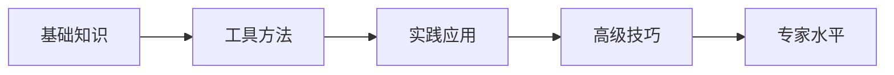

# {{领域名称}} - 知识地图
>*目标掌握程度说明：⭐基础概念，无需应用，了解即可；⭐⭐入门，可简单应用；⭐⭐⭐基本掌握，可应付大部分常见应用场景；⭐⭐⭐⭐熟练，掌握部分高级技巧；⭐⭐⭐⭐⭐专家。*

> 📅 [状态更新时间::{{date}}]
> 🎯 [学习目标::] 在此描述你希望通过学习这个领域达到什么水平  
> 📊 [目前掌握程度::⭐] (1-5星，定期更新，默认一星。)  
> 📊 [计划掌握程度::⭐⭐⭐]  (1-5星，默认三星。)  
> ⏰ [预计学习周期::]

---

## 🎯 概览 (Overview)

### 📋 领域定义
>*简明扼要地定义这个领域是什么*

### 🔑 核心价值
>*学习这个领域的核心价值和应用场景*

### 🗺️ 学习路径



---

## 📚 核心概念体系 (Core Concepts)

### 🌟 基础概念 (Fundamentals)

- 概念1 - 简短描述
- 概念2 - 简短描述
- 概念3 - 简短描述

### 🏗️ 核心概念 (Core Concepts)

- 高级概念1 - 应用场景
- 高级概念2 - 应用场景

### 🔗 关联概念 (Related Concepts)

- 关联概念1 - 与核心概念的关系
- 关联概念2 - 与核心概念的关系
- 关联概念3 - 与核心概念的关系

---

## 🏛️ 知识架构 (Knowledge Architecture)

### 🌳 概念关系图
[mindmap]

- 领域根节点
  - 分支1：基础理论
    - 子概念1-1
    - 子概念1-2
  - 分支2：实践应用
    - 子概念2-1
    - 子概念2-2
  - 分支3：高级应用
    - 子概念3-1
    - 子概念3-2

### 🔄 知识依赖关系

- 前置知识1 → 当前概念 → 后续知识1
- 前置知识2 → 当前概念 → 后续知识2

---

## 🛠️ 工具与技术 (Tools & Technologies)

### 🔧 必备工具

|工具名称|用途|熟练度|相关笔记|
|---|---|---|---|
|工具1|主要功能描述|⭐⭐⭐|使用指南|
|工具2|主要功能描述|⭐⭐|配置说明|

### 🔌 扩展工具

- [/] 辅助工具1 - 特定场景使用
- [/] 辅助工具2 - 效率提升工具

---

## 📖 学习资源 (Learning Resources)

### 📗 推荐书籍

- [/] 《书名1》 - 读书笔记链接
- [/] 《书名2》 - 读书笔记链接

### 🎥 视频教程

- [/] 课程名称1 - 学习笔记
- [/] 课程名称2 - 学习笔记

### 🔗 在线资源

- [/] 官方文档 - 重要摘录
- [/] 社区论坛 - 问题解答
- [/] 博客文章 - 精选文章笔记链接

### 📝 实践项目

- [/] 项目1 - 基础练习项目
- [/] 项目2 - 综合应用项目

---

## 🎯 实践应用 (Practical Applications)

### 💼 应用场景

1. **场景1**：具体应用案例1
2. **场景2**：具体应用案例2
3. **场景3**：具体应用案例3

### 🔥 常见问题与解决方案

- [/] 问题1 - 解决方案笔记
- [/] 问题2 - 解决方案笔记
- [/] 问题3 - 解决方案笔记

---

## 🗂️ 分类索引 (Category Index)

### 📑 按难度分类

#### 🟢 入门级 (Beginner)

- 笔记1 - 笔记2 - 笔记3

#### 🟡 中级 (Intermediate)

- 笔记4 - 笔记5 - 笔记6

#### 🔴 高级 (Advanced)

- 笔记7 - 笔记8 - 笔记9

### 🏷️ 按主题分类

- **理论基础**：理论笔记1 | 理论笔记2
- **实操技能**：实操笔记1 | 实操笔记2
- **最佳实践**：实践笔记1 | 实践笔记2

---

## 📈 学习进度追踪 (Progress Tracking)

### 📊 完成情况统计
>*根据实际学习进度手动更新数据*

已掌握：X/Y 个概念 (X%)
```apb
Progress: 7/15
```

### 🗓️ 学习里程碑

- [/] **第1周**：掌握基础概念 
- [/] **第2周**：熟悉核心工具 
- [/] **第3周**：完成第一个项目 
- [/] **第4周**：掌握进阶技巧 

### 📝 学习日志

|日期|学习内容|时长|收获|相关笔记|
|---|---|---|---|---|
|2024-XX-XX|概念学习|2h|理解了XX|笔记链接|
|2024-XX-XX|实践练习|3h|完成了XX项目|项目笔记|

---

## 🔍 相关领域连接 (Related Domains)

### 🔗 上游知识领域

- 相关领域1 - 如何关联到当前领域
- 相关领域2 - 提供了什么基础

### 🔗 下游应用领域

- 应用领域1 - 当前知识如何应用
- 应用领域2 - 可以解决什么问题

### 🔗 平行领域

- 相似领域1 - 可以借鉴的经验
- 相似领域2 - 互补的知识点

---

## 📋 待办清单 (Todo List)

### 🚀 近期目标 (本月)

- [/] 任务1 - 截止日期
- [/] 任务2 - 截止日期
- [/] 任务3 - 截止日期

### 📅 中期目标 (3个月内)

- [/] 中期目标1
- [/] 中期目标2

### 🎯 长期目标 (6个月+)

- [/] 长期目标1
- [/] 长期目标2

---

## 💡 思考与反思 (Reflection)

### 🤔 关键洞察
> *在这里记录学习过程中的重要发现和深度思考*

### 🔄 知识迭代
> *记录对已有知识的新理解和修正*

### 🎓 经验总结
> *总结最有效的学习方法和实践经验*

---

## 🔖 快速导航 (Quick Navigation)

**🔥 最常用**：常用笔记1 | 常用笔记2 | 常用笔记3

**📚 理论基础**：基础理论总览 | 核心概念汇总

**🛠️ 实用工具**：工具使用指南 | 配置备忘录

**💼 项目实践**：项目清单 | 最佳实践

**❓ 问题解答**：FAQ汇总 | 疑难问题

