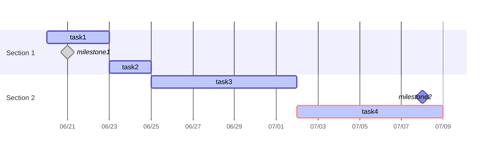

---

created: 2025-06-21

status: completed

type: readme

area: Obsidian

tags: []

---

2025-11-17 更新：放宽生成条件，不再依赖固定的 `## 项目分解` 标题，而是根据二级或三级标题生成。二级套三级标题生成带section的甘特图，单独二级或三级标题生成不带section的甘特图。解析开始标志为星号分隔符 `***`
[[gantt-with-svg-export2.js]]

>👆这个方案有bug，只能在独立的甘特图笔记里使用，有其他模块的标题会产生干扰，无法生成甘特图

---

2025-10-23 更新：添加导出svg图片功能（仅阅读状态下可以成功导出svg图片，实时预览无法导出）；依靠`## 项目分解`解析
[[gantt-with-svg-export.js]]

---

2025-09-06 更新：milestone由关键词改为标签 #milestone 
[[convertToMermaidGantt(update20250906).js]]

---
2025-09-04 更新: 【ver4】下拉菜单弹窗  
[[convertToMermaidGantt(update20250904).js]]

主要修改 `inputPrompt` 的调用方式，让用户可以直接从预设选项中选择，而不需要手动输入。

## 主要改进
1. **下拉菜单选择器**：
    - 使用 `suggester` API 替代手动输入
    - 为每个选项提供图标和详细描述
    - 用户可以直接从列表中选择，避免输入错误
2. **周末设置选项**：
    🏢 排除周末（只计算工作日）
    📅 包含周末（按日历天数计算）
3. **插入方式选项**：
    📍 光标位置插入
    📄 文件末尾追加  
    🔄 替换现有甘特图
    📋 复制到剪贴板
4. **用户体验改进**：
    - 添加了图标让选项更直观
    - 为每个选项提供描述信息
    - 增加了取消操作的处理
    - 优化了通知消息，添加了表情符号和更详细的信息
    - 添加了任务统计信息显示
5. **错误处理**：
    - 用户可以在任何选择步骤取消操作
    - 更好的错误提示信息

---

脚本文件：
- 【ver3】在用版本，弹框选择是否含周末：[[convertToMermaidGantt.js]]
- 【ver2】计工作日天数，显示周末：[[convertToMermaidGantt-excludeWeekend.js]]
- 【ver1】计自然日天数，不显示周末：[[convertToMermaidGantt-includeWeekend.js]]

---

做项目管理时，甘特图是一种可视化项目和任务进度的优秀工具。但是手工绘制甘特图十分繁琐，而专门的项目管理软件有时又略显复杂。Obsidian原生支持的Mermaid可视化图表提供了一个甘特图的图表选项，让我们能通过代码快速生成一个简要的甘特图，可以满足相对简单项目的进度管理或管理大项目的分解项目。

然而，记忆Mermaid甘特图的语法有些困难，修改也比较费时，代码的方式对普通人来说还是太反直觉了。因此，我让AI帮我做了这个小工具。用于将tasks插件格式的任务快速转化成mermaid甘特图代码。实现一键生图的效果。

主要功能、使用方法、注意事项、范例如下：

## 主要功能：

1. **任务解析**：自动从 `## 项目分解` 标题下提取任务信息
2. **支持Tasks插件任务属性**：
    - 开始日期 🛫
    - 截止日期 📅
    - 任务ID 🆔
    - 依赖关系 ⛔
    - 高优先级标记 🔺
    - 完成状态 [x]
3. **里程碑标记**：通过Dataview内链，用[keyword::@milestone]格式标记
4. **智能日期处理**：自动计算任务持续时间
5. **灵活插入选项**：
	- **cursor** - 在光标位置插入（默认）
	- **append** - 追加到文件末尾
	- **replace** - 替换现有甘特图
	- **copy** - 复制到剪贴板

## 使用方法：

1. 将代码`convertToMermaidGantt.js`保存到笔记库任意文件夹
2. 在 Obsidian 中安装 QuickAdd 插件
3. 在QuickAdd插件中添加新的宏，选择刚刚保存的脚本文件
4. 在包含任务的笔记中运行宏
5. 选择甘特图插入方式，默认cursor（在光标位置插入）
6. 任务更新时重新运行命令，将curesor替换为replace，即可刷新甘特图

## 注意事项：

- 确保任务格式正确，特别是日期格式（YYYY-MM-DD）
- 脚本会自动识别三级标题作为甘特图的 section
- 里程碑任务持续时间自动设为 0d
- 支持任务依赖关系的可视化
- 目前只识别Tasks插件的 `task表情格式`，请勿使用 `Dataview格式`
- 通过Tasks插件生成甘特图关联的项目如下👇

![[bb884e5a98a76cece1cda34aa184c0a0_MD5.png]]

## 范例：

- **注意**：甘特图相关任务必须放在二级标题 `## 项目分解` 中，二级标题的名称不能更改。如要修改，需要调整源代码。

---

## 项目分解

### Section 1

- [ ] task1 🛫 2025-06-20 📅 2025-06-23 🆔 nkf49w #exclude
- [x] milestone1 📅 2025-06-21 [keyword::@milestone] #exclude
- [ ] task2 📅 2025-06-25 ⛔ nkf49w #exclude

### Section 2

- [ ] task3 🛫 2025-06-25 📅 2025-07-02  🆔 p9etar #exclude
- [ ] milestone2 📅 2025-07-08 [keyword::@milestone] #exclude
- [ ] task4  📅 2025-07-09 🔺 ⛔ p9etar #exclude

## 甘特图

如果喜欢这篇文章，欢迎点赞👍、关注🧡、留言☺️~
